<p align="center">
  
</p>

# claude-evp

> Replace a $10K-15K positioning sprint with the Schwartz-tier EVP
> framework, as a Claude Code skill pack.

Generates **Existential Value Propositions** — the 22-word line that
says *"For <ICP> in <pain>, we ship <specific outcome> without
<obvious tradeoff>."* Uses the **Eugene Schwartz 5-tier awareness
model** so you get a different line for each tier of your audience.

Based on the **[JMC EVP course](https://jaymountconsulting.com/learn/courses/evp-generator)**.
No LLM calls inside the skill. Deterministic scoring catches abstract
verbs, missing metrics, and tier-mismatched lines.

[](LICENSE)
[](https://github.com/cmj-hub/claude-evp)


<p align="center">
  
</p>


## What it does

```mermaid
graph LR
    A["/evp"] --> B{Kickoff: state check}
    B -->|First time| C[Onboarding<br/>brand-config + SOUL]
    B -->|Have config| D[Craft / Brief]
    C --> D
    D --> E[Score EVP<br/>script]
    E -->|≥70| F[Push to claude-cold-email + hero copy]
    E -->|<70| D

    style C fill:#1a1a2e,stroke:#00d4ff
    style E fill:#1a1a2e,stroke:#cc4714
```



## The 4 sub-skills

| Sub-skill | What it does |
|---|---|
| `evp-kickoff` | Adaptive router — detects state (brand-config? PSP loaded? tier set? proofs reservoir?) and picks next-best step |
| `evp-onboarding` | 10-min interactive setup → brand-config.json + SOUL.md with outcomes/tradeoffs/proofs |
| `evp-craft` | Generate 3 EVP variants for a specific tier (outcome-led / tradeoff-led / ICP-led) |
| `evp-brief` | Structured 3-tier brief — Tier 2 / 3 / 4 side-by-side with proof per tier |

## The deterministic script

| Script | Job |
|---|---|
| `scripts/score_evp.py` | Score any EVP draft 0-100 across 5 axes (length, outcome specificity, tradeoff specificity, ICP named, tier-fit). Catches abstract verbs ("improve", "optimize"), missing metrics, missing tradeoffs, and tier mismatches. |

Verified: strong T3 EVP scores 100/100; "We help companies improve their growth and optimize outcomes" scores 59/100 with per-axis flags.

## The Schwartz model

| Tier | Buyer knows | EVP shape |
|---|---|---|
| 1 — Unaware | Doesn't know they have the pain | Pain reveal |
| 2 — Problem-aware | Pain exists; no solutions known | Pain + reframe |
| 3 — Solution-aware | Solutions exist; comparing categories | Category split |
| 4 — Product-aware | Comparing vendors | Vendor delta |
| 5 — Most aware | Ready to buy | Direct ask |

Most B2B buyers live in Tiers 2-4. Most operators write Tier-5 EVPs
(their internal product team's view) and wonder why nothing lands.

## The 3-tier config

```
brand-config.json   ← Primary tier + outcomes-will-claim + tradeoffs + competitors
SOUL.md             ← Per-tier voice + proofs reservoir + won't-claim list
AGENTS.md           ← Refuses vague outcomes, refuses made-up proof
```

The skill refuses to generate an EVP without these set up.

## Install

### Claude Code

```bash
/plugin marketplace add cmj-hub/claude-evp
/plugin install evp
```

### One-line install

```bash
curl -fsSL https://raw.githubusercontent.com/cmj-hub/claude-evp/main/install.sh | bash
```

## Usage

```
> /evp
```

Adaptive kickoff. First run → routes to `evp-onboarding`. Once
configured:

```
> Write a Tier 3 EVP for my ICP
```

Returns 3 variants (outcome-led, tradeoff-led, ICP-led), all ≤22
words, all using the operator's outcomes-will-claim list, all using
PSP vocabulary, all tier-fit-verified.

## Cost arbitrage

| Role | $ range | What you'd outsource |
|---|---|---|
| Positioning sprint | $10K-15K | One ICP segment, 1-2 weeks |
| Messaging architect | $5K-12K | Hero copy + pricing page lines |
| Brand strategy consultant | $25K+ | Multi-segment positioning system |

This skill pack does the structural work — generates variants by tier,
validates per axis, surfaces the brief. It does NOT replace TALKING
to real buyers about their language (that's the PSP layer). It DOES
replace the structural drafting work.

## Plugs into

- **[cmj-hub/claude-psp](https://github.com/cmj-hub/claude-psp)** — the pain layer underneath every EVP
- **[cmj-hub/claude-cold-email](https://github.com/cmj-hub/claude-cold-email)** — EVP is line 3 of every cold email
- **[cmj-hub/claude-founder-brand](https://github.com/cmj-hub/claude-founder-brand)** — Pillar pillar content is often a Tier 2 EVP reformatted

## Course

→ [jaymountconsulting.com/learn/courses/evp-generator](https://jaymountconsulting.com/learn/courses/evp-generator)

Want it all-access? **[Operator Pass](https://jaymountconsulting.com/operator-pass)**.

## License

MIT. Built by [Jay Mount Consulting](https://jaymountconsulting.com).
