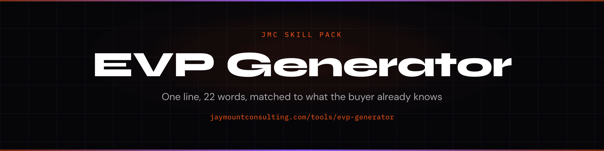

<p align="center">
  
</p>

# Value proposition skill for Claude Code

A value proposition is one line that says why this buyer should care. The same product needs a different line for each buyer.

> Same product. Five readers. Twenty-two words each. Because they are not standing in the same place.

An Early Value Proposition is a ≤22-word line matched to a Schwartz awareness tier. Same product, five lines, because the unaware buyer and the vendor-comparing buyer are not the same reader.

You have been writing one line — the line *you* would buy. That is a Most-Aware line. Most of the people who land on your page are not there. They are still naming the pain, or comparing categories, or lining you up against a vendor they already know.

Eugene Schwartz's awareness model is the mechanism: unaware, problem-aware, solution-aware, product-aware, most-aware. One product. Five openings. The scorer in this repo checks length, outcome, tradeoff, ICP, and tier-fit.

A specific Tier-3 line scored **100**. "We help companies improve their growth and optimize outcomes" scored **59**. The Python is in `scripts/score_evp.py`. No LLM. No paid API.

The build guide teaches the framework to a human. This pack teaches the same framework to an agent.

[](https://claude.ai/claude-code)
[](LICENSE)
[](https://github.com/cmj-hub/claude-evp)
[](https://skills.sh/cmj-hub/claude-evp)


<p align="center">
  
</p>

## What this replaces

A $10K–15K positioning sprint's first output: one hero line, written from inside the building.

## Install

Two commands. Works in Claude Code, Cursor, Codex, Grok, Copilot, Windsurf, Cline, OpenCode, and the rest of the [skills CLI](https://skills.sh) list.

```bash
npx skills add cmj-hub/claude-evp --all -g --full-depth
```

```text
/plugin marketplace add cmj-hub/gtm-operator-skills
/plugin install evp
```

Also: `npm install github:cmj-hub/claude-evp` then `npx jmc-evp`. Or `curl -fsSL https://raw.githubusercontent.com/cmj-hub/claude-evp/main/install.sh | bash`.

## What you walk out with in 15 minutes

Artifact: `examples/t3.good.txt`.

```bash
python3 scripts/score_evp.py \
  --evp "For Series-B SaaS in a pipeline gap, we ship 14+ SQLs per month without hiring 2 more SDRs." \
  --tier 3 --icp "Series-B SaaS"
python3 scripts/score_evp.py --evp "We help companies improve their growth and optimize outcomes." --tier 3
python3 scripts/score_evp.py --file examples/t3.good.txt --tier 3 --icp "Series-B SaaS"
python3 scripts/score_evp.py --file examples/value-props.json
```

A passing run prints `# Proposition` and the line. `examples/value-props.json` exits 1. The line is `Refusal: a list of value props is not one proposition`.

Three tier lines from the sample Pain Signal Profile. Then yours. The shipped artifact is one of those lines.

## What this pack will not do

It will not pick this quarter's PSP. It will not invent proof you did not hand it. It will not write five ads from a blank page.

This pack drafts and scores. It will not pick this quarter's PSP, ingest your CRM, or update when Gmail changes the spam window. Those are judgement calls and live data. This pack gives you the instrument and the rubric; you bring the account.

## Why 22 words?

Long enough for ICP, pain, one outcome, and one tradeoff. Short enough to sit in a cold-email third line or a hero. If it does not fit, you have two claims. Cut one.

## Which Schwartz tier should I write first?

Tiers 2–4. That is where B2B buyers live. Tier 5 is a direct ask — your internal product view. Unaware (Tier 1) is a pain reveal, not a product sentence.

## Do I need Operator Pass to use this?

No, and there is no key to enter. The pack, the scorer, and the sample are MIT. If you would rather not install anything, the [EVP Generator](https://jaymountconsulting.com/tools/evp-generator) writes the same line in your browser.

## Free, no signup

- **[EVP Generator](https://jaymountconsulting.com/tools/evp-generator)** — the same job as this pack, hosted. No account, no key.
- [Early Value Propositions framework](https://jaymountconsulting.com/frameworks/early-value-propositions)
- [EVP Brief Generator](https://jaymountconsulting.com/tools/evp-brief-generator)

## Free, by email

[**Growth Audit**](https://jaymountconsulting.com/growth-audit) — where your go-to-market stack is leaking, sent to your inbox.

That one does ask for an email, and it enrols you in a short follow-up on the same topic. Unsubscribe whenever.

[**The Friday Signal**](https://jaymountconsulting.com/newsletter/signal) — one free edition a week on building GTM systems that compound. No pitch in it.


## Companion packs

- [claude-psp](https://github.com/cmj-hub/claude-psp) — Ideal customer profile
- [claude-cold-email](https://github.com/cmj-hub/claude-cold-email) — Cold email
- [claude-founder-brand](https://github.com/cmj-hub/claude-founder-brand) — LinkedIn posts
- [claude-pricing](https://github.com/cmj-hub/claude-pricing) — Pricing strategy
- [claude-landing-page](https://github.com/cmj-hub/claude-landing-page) — Landing page
- [claude-geo](https://github.com/cmj-hub/claude-geo) — Generative engine optimization
- [claude-sales-offer](https://github.com/cmj-hub/claude-sales-offer) — Sales offer
- [claude-prospect-list](https://github.com/cmj-hub/claude-prospect-list) — Sales prospecting
- [claude-email-sequence](https://github.com/cmj-hub/claude-email-sequence) — Email sequence

## License

MIT. See [LICENSE](./LICENSE).

## About

Built by [Jay Mount Consulting](https://jaymountconsulting.com).

## Regenerating the artwork

`assets/social-preview.png` and `assets/header.png` are generated from `assets/spec.json` by a vendored renderer — no CI, no shared workflow, no network beyond the webfonts:

```bash
node assets/card.mjs assets/spec.json assets/          # social-preview.png + header.png
npm i playwright-core && node assets/demo.mjs assets/spec.json assets/demo.gif
```
